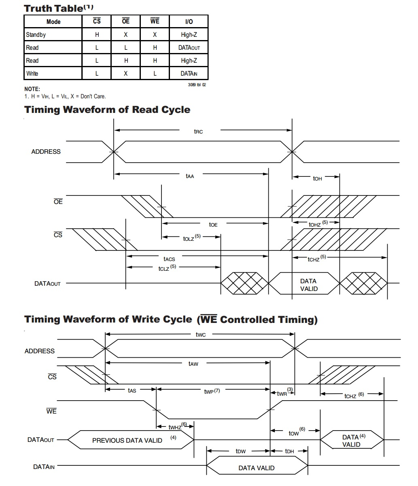
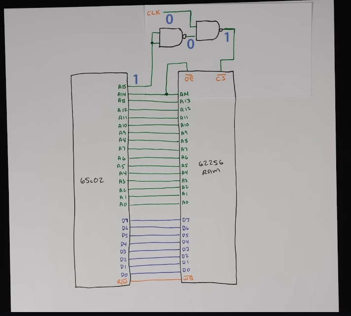

## Notes from 6502 project

##### Command to program eeprom:
```minipro -p 28C256 -uP -w rom.bin```

##### Command to display binary file:
```hexdump -C rom.bin```

##### [Software for assembling](http://sun.hasenbraten.de/vasm/)
Compiled with: ```make CPU=6502 SYNTAX=oldstyle```
Run with: ```./vasm6502_oldstyle -Fbin -dotdir <example>.s```
```./vasm6502_oldstyle -Fbin -dotdir helloworld.s && hexdump -C a.out```
##### Ben Eater 6502 current video location
How assembly language loops work
10:12
##### Arduino hook up
Address lines are in reverse ascending order 
so are data lines
dont forget clock, ground and read/write mode pin

##### Helful link
[Hex to binary](https://www.rapidtables.com/convert/number/hex-to-binary.html)

#### Assembly notes
- $ or 0x means hex, % or 0b means binary
- "#" means load immediate


#### Thoughts
- Bit of survivorship bias in the note taking process. what you write down you remember, so it feels like you dont need to write things down. lol

- Tristate = High impedance.
So for communication between chips, the pins first need to be set to either tristate or low impedance, then they get written to wherever they're going. 
So I'm a CPU whos gonna read from some RAM.
I'm gonna let the RAM be read from (write enable goes high)
Yo this is the shit I need (setting address). 
Yo RAM get ready for me to read you (chip select goes low). 
Now let me read you (Output enable goes low). 
Okay done reading you (CS high, then OE high, then WE stays high..)\
At a neutral state the the RAM has its output enable and write enable pin high. That way it does neither. (the yare both active low)

- The only thing that writes to the address bus is the CPU

- baud rate vs clock speed?


#### ollama set up
oco config set OCO_AI_PROVIDER='ollama' OCO_MODEL='mistral'
oco config set OCO_API_URL=http://localhost:11434/api/chat

#### RAM and bus timing notes
- [This image helped with understanding](https://electronics.stackexchange.com/questions/107183/meaning-of-control-pins-ce-oe-we) 
- 
- I suppose it's okay if the addresses are not valid and the write enable pin gets set 
